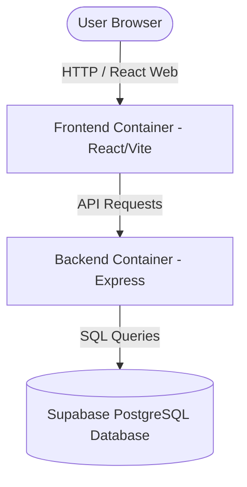

# Implementation Plan: Web App Pivot & Dockerization

This plan outlines the steps to pivot the mobile React Native (Expo) frontend into a standard React + Vite web application, and containerize both the frontend and backend services using Docker and Docker Compose.

---

## Proposed Architecture

---

## Proposed Changes

### 1. Frontend Web Pivot (`frontend/`)
We will delete the mobile Expo configurations and bootstrap a lightweight React + Vite web project.

* **[DELETE]** Mobile-specific files: `App.js`, `app.json`, `index.js`, `eas.json`, `.expo/`, and `src/screens/*` (React Native views).
* **[NEW] [package.json](file:///d:/word-power-app/frontend/package.json)**: Bootstrapped with React, Vite, Axios, and Tailwind CSS / Vanilla CSS.
* **[NEW] [vite.config.js](file:///d:/word-power-app/frontend/vite.config.js)**: Configures Vite server.
* **[NEW] [index.html](file:///d:/word-power-app/frontend/index.html)**: Main entry point for the browser.
* **[NEW] [src/App.jsx](file:///d:/word-power-app/frontend/src/App.jsx)**: Main router showing Login, Home, WordGroup, Quiz, and Streak screens.
* **[NEW] [src/api/client.js](file:///d:/word-power-app/frontend/src/api/client.js)**: Axios client configured to talk to the backend container.
* **[NEW] [src/components/](file:///d:/word-power-app/frontend/src/components/)**: Web components for the UI (WordCard, Navigation Bar).

### 2. Dockerization (`/`)
We will containerize the application to demonstrate system design and container orchestration concepts.

* **[NEW] [backend/Dockerfile](file:///d:/word-power-app/backend/Dockerfile)**: Multi-stage Docker build for the Express API. It runs database migrations, generates the Prisma client, and boots the Node server.
* **[NEW] [frontend/Dockerfile](file:///d:/word-power-app/frontend/Dockerfile)**: Multi-stage Docker build for the React web app. Builds the static assets using Vite and serves them using an Nginx web server container.
* **[NEW] [docker-compose.yml](file:///d:/word-power-app/docker-compose.yml)**: Configures the orchestration, linking the frontend and backend containers, setting up container networks, and injecting environment variables.

---

## Verification Plan

### Manual Verification
1. Run `docker compose up --build` in the root folder.
2. Confirm both containers build successfully.
3. Open `http://localhost` (or the configured port) in the browser.
4. Verify the user-friendly web interface loads, connects to the database via the backend container, and executes quizzes/audio pronunciations.
